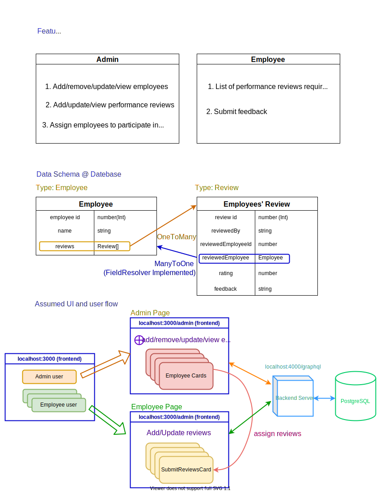

# Brief Report about The Challenge

## Features and database schema




## Server Side (http://localhost:4000/graphql)

1. Considering limited bandwidth and reducing the frequency of back-and-forth communication, the server side is developed with GraphQL.
2. No sessions and no tokens for different users are implemented.
3. Ids of Employee and Review identities are all integers for easier development.
4. Although rating field is implemented in the entity file, the related UI in frontend and resolvers in backend are not implemented yet.
5. Due to time constraints, the FieldResolver is only implemented when necessary to reduce the number of queries to the PostgreSQL database. For instance, currently only the reviewedEmployee field is implemented for knowing whom to be reviews when employees are editing their reviews.

## Configuration and Running the Code

```jsx
# For database configuration in /server/src/index.ts
await createConnection({
    type: 'postgres',
    database: 'employeeReviews',
    username: 'jenson',
    password: '0716',
    logging: true,
    synchronize: true,
    entities: [Employee, Review],
  })
```

The above database can be renamed with other, and also the username and password can be changed according to your PostgreSQL configuration in your local environment.

### Server Side (/server)

```jsx
yarn install // To install the used libraries
yarn watch  // To compile the ts files into js ones
yarn dev // To start the server
```

### Client Side (/web)

```jsx
yarn install // To install the used libraries
yarn dev // To start the client side
```

## Todo Item for Further Improvements

- Refactoring is necessary for cleaner code, better readability, and modularization of code;
- Global state statement or more modern state management libraries can be used to have a responsive frontend;
- Urql ([https://formidable.com/open-source/urql/](https://formidable.com/open-source/urql/)) and its related libraries can be further studied and developed to allow SSR under the Next.js framework.
- Better UI components and UI design, for instance, the employee card container to view the feedback can be collapsed or design in a carousel style for cleaner UI.
